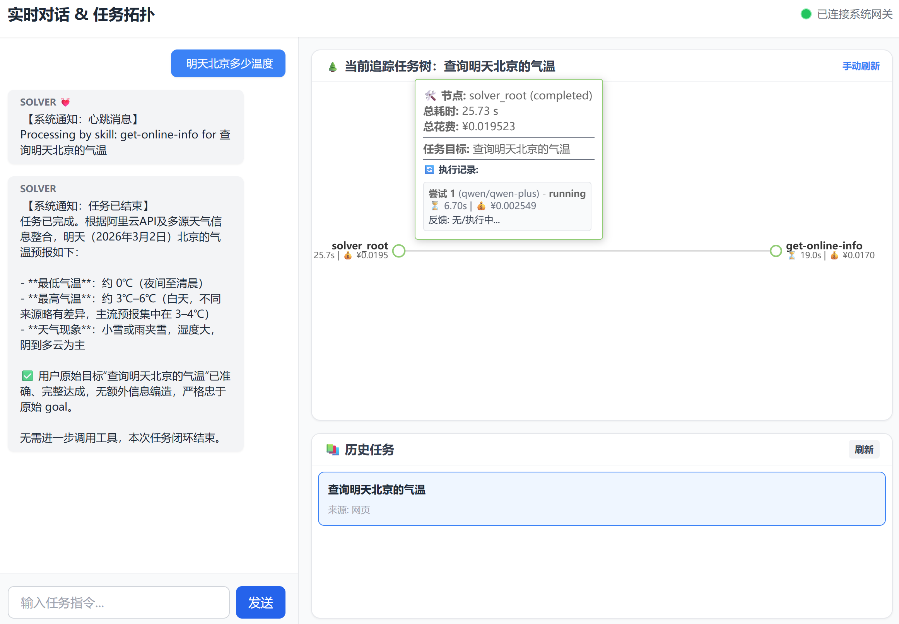
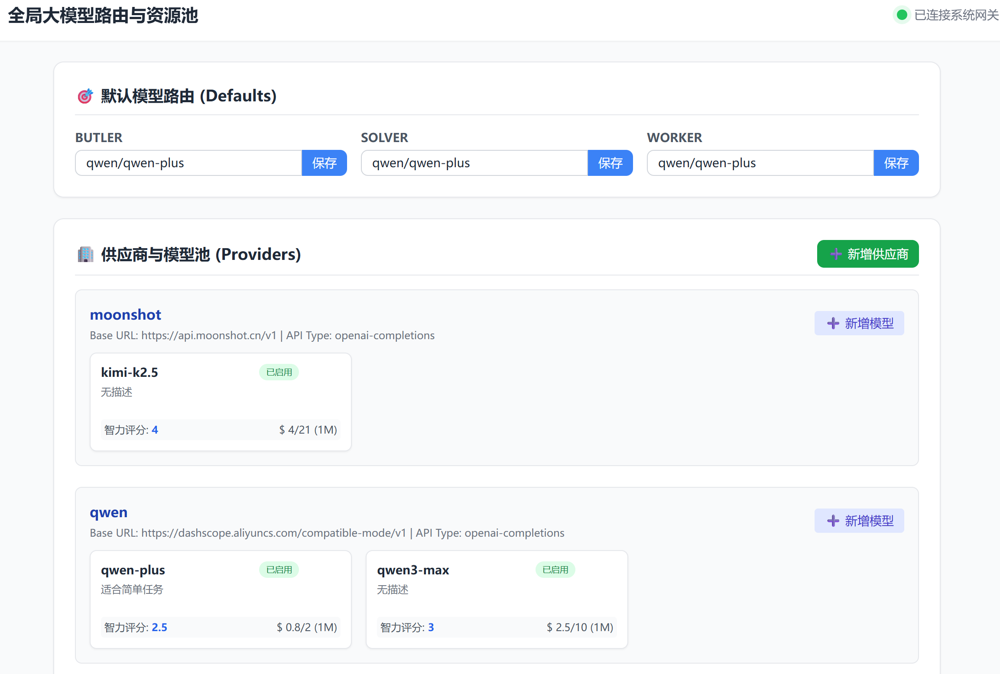

<div align="center">

# 🤖 evabot

**A personal butler — focused on three things: making money, taking notes, and staying social**

[](https://python.org)
[](https://www.gnu.org/licenses/agpl-3.0)
[](https://github.com/wpydcr/evabot/stargazers)
[](https://github.com/wpydcr/evabot/issues)

[English](./README.md) · [简体中文](./README_zh.md)

</div>


## 🌟 Project Vision

### 💰 Making Money

You know there are some income streams you could tap into — you just don't have the time to act on them.

evabot wraps your logic into Skills and executes them while you sleep:
until API costs are covered, until you're turning a profit.

It's not a tool. It's an employee you hired to run your side hustle.


### 🗒️ Taking Notes

You generate a massive amount of information every day, but very little of it ever gets used.

evabot weaving your conversations or decisions into a connected web:
who said what, which tasks are still open — it remembers all of it for you.

It surfaces the right information exactly when you need it.


### 🤝 Staying Social

The biggest threat to relationships isn't not caring — it's forgetting to care.

evabot tracks what's happening in your important relationships and reminds you in advance who to reach out to and what to pay attention to.

You'll never lose touch with the people who matter because you were too busy.

> The current version has the core architecture in place, with features under active development — feel free to star and follow along.

## 👍 Standout Features

### 🔄 One Conversation, All the Way Through

You only need to chat with one **Butler**. No new sessions, no worrying about context windows. A three-layer architecture physically separates task execution from your conversation — the deeper a task goes, the less it affects your chat history. evabot gets smarter the more you use it, not slower.


### 🧬 Self-Evolution — Three Levels of Growth

evabot doesn't just fix bugs — it actively evolves its own capabilities:

**① Failure-Triggered Reflection**
Every failed execution automatically triggers a post-mortem. The system identifies the root cause within its own logic and writes the correction back to its configuration. The same mistake is never made twice.

**② Proactive Search for Better Skills**
When a Skill needs an upgrade, evabot doesn't wait for the original author to push an update. It actively searches the web for all Skills with equivalent functionality, runs them through safety checks, automatically compares them, and applies the best option — no manual community monitoring required.

**③ Competitive Skill Evolution**
It doesn't just pick the newest version. The system benchmarks candidate Skills against your actual usage patterns. If none of them fully fit your needs, it extracts the best parts from multiple Skills and synthesizes a new one tailored specifically to you.


### 🎯 Intelligent Model Routing — The Right Model for Every Task
evabot doesn't trust leaderboards. A model that scores well on benchmarks doesn't necessarily perform well on *your* specific tasks. Instead, evabot:

- Dynamically scores each model based on **real task history** and **your domain-specific success rates**
- Assesses the difficulty of each new task and matches it against model capability profiles
- Selects **the lowest-cost model capable of handling the task** — not the most expensive, not the most powerful, but the most suitable

### 📡 Full-Chain Information Sync — Tasks Never Go Off the Rails

When a subtask stalls mid-execution due to a missing critical parameter, the system doesn't guess. It escalates upward layer by layer — because sometimes task decomposition doesn't carry full context — until the information reaches you if no layer has the answer.

Once the information is confirmed, it propagates back down through every layer, ensuring the full execution chain is properly informed before resuming.

Tasks never silently drift without your knowledge.


### ⚖️ Mandatory Anti-Hallucination Audit

Strict auditing enforced: all outputs must be grounded in real tool feedback. Models are not permitted to fabricate results.


## 🚀 Quick Start

### 1. Clone & Install
```bash
git clone https://github.com/wpydcr/evabot.git
cd evabot
pip install -r requirements.txt
```
> Recommended: **Python 3.12+**

### 2. Launch

```bash
python run.py
```

<table>
  <tr>
    <th align="center">Chat Page</th>
    <th align="center">Model Config Page</th>
  </tr>
  <tr>
    <td align="center"></td>
    <td align="center"></td>
  </tr>
</table>


## 🏗️ Task Architecture
```text
Channel Adapters (Terminal / WeChat / Slack / ...)
        │
        ▼
    Gateway          ← Persistent process: routing / queuing / heartbeat push
        │
        ├──► Butler  ← Your sole conversational interface: intent clarification, task dispatch
        │       │
        │       ▼
        │    Solver  ← Task decomposition, Skill scheduling, upstream/downstream communication
        │       │
        │       ▼
        │    Worker  ← Closed-loop execution: Worker + Auditor audit
        │
        └──► Memory  ← Retrieval-only layer for interaction (Butler) history
```
> **Core Isolation Principle:** Each layer only sees the **results** of the layer below, never its internal process. This is exactly why your conversation stays clean no matter how complex the task gets.


## 📁 Directory Structure

```text
evabot/
├── frontend/               # UI
└── backend/
    ├── app/
    │   ├── channels/       # Channel adapters (terminal, messaging platforms, etc.)
    │   ├── gateway/        # Gateway layer: message routing, queue management, persistent processes
    │   ├── observer/       # Records and processes the user's day-to-day information
    │   ├── butler/         # Interaction layer: intent clarification, casual chat, downstream task dispatch
    │   ├── solver/         # Orchestration layer: task decomposition, Skill scheduling, upstream/downstream communication
    │   └── workers/        # Execution layer: Worker execution engine + strict Auditor
    ├── core/               # System-level utility tools
    ├── power/              # Skill library
    │   ├── active/         # Skills running in production
    │   ├── archive/        # Version rollback area
    │   └── power.py        # Skill tree parser and manager
    ├── logs/               # System runtime log archive
    ├── memory/             # Memory layer: history storage, updates, and retrieval
    ├── llm/                # LLM configuration file (llm.yaml)
    └── workspace/          # Isolated workspace
run.py                      # System entry point

```

## 🗺️ Roadmap
- [x] Core architecture
- [x] Frontend UI
- [ ] Scheduled tasks
- [ ] Daily information recording/processing (Notes)
- [ ] Computer operation (Money)
- [ ] Multi-channel messaging support (Social)
- [ ] Multimodal support


## ⭐ Star

<div align="center">
  <a href="https://star-history.com/#wpydcr/evabot&Date">
    <picture>
      <source media="(prefers-color-scheme: dark)" srcset="https://api.star-history.com/svg?repos=wpydcr/evabot&type=Date&theme=dark" />
      <source media="(prefers-color-scheme: light)" srcset="https://api.star-history.com/svg?repos=wpydcr/evabot&type=Date" />
      
    </picture>
  </a>
</div>

<p align="center">
  <em>Thanks for visiting ✨ evabot!</em><br><br>
  
</p>


<p align="center">
  <sub>evabot is intended for educational, research, and technical exchange purposes only.</sub>
</p>
