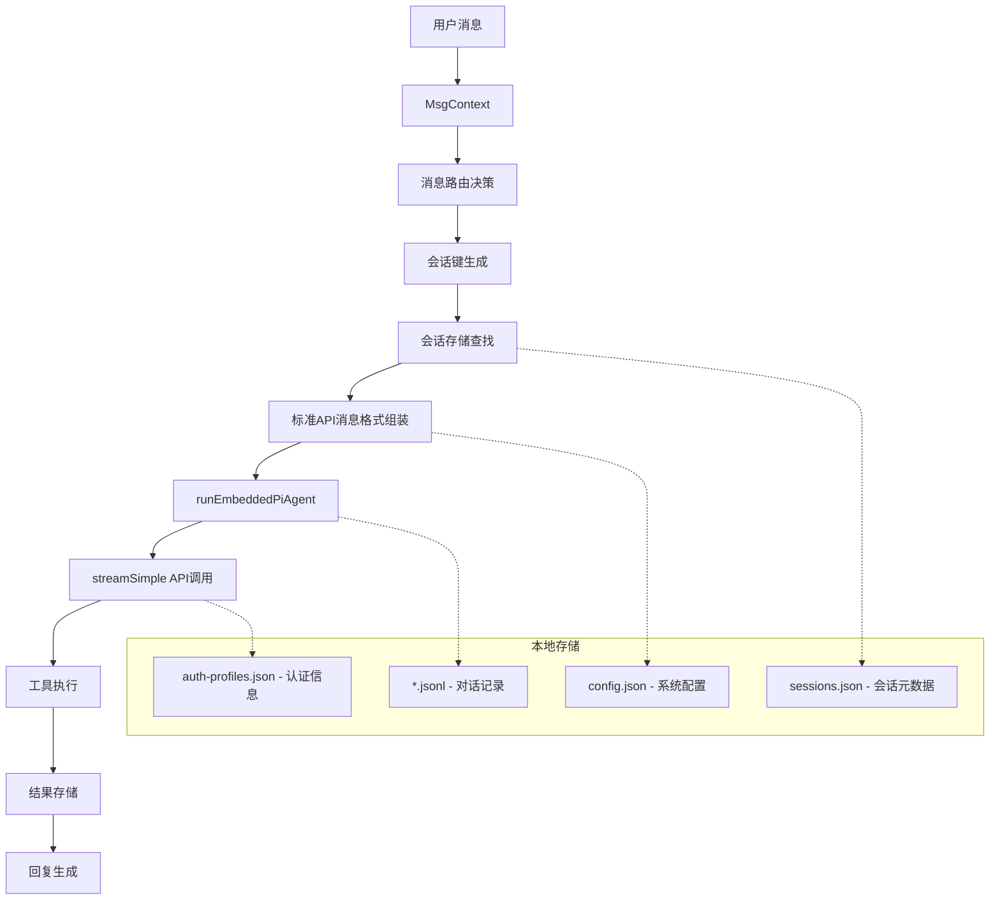

# OpenClaw 数据结构

```agsl
 客户端信息: {
  id: 'openclaw-control-ui',
  version: 'dev',
  platform: 'MacIntel',
  mode: 'webchat'
}
```
## 1. 大模型API核心消息格式规范

### 1.1 标准API消息结构 (符合OpenAI/Anthropic规范)

#### 完整消息格式
```json
{
  "role": "user" | "assistant" | "system",
  "content": [
    {
      "type": "text",
      "text": "消息内容"
    }
  ],
  "timestamp": 1738751400000,
  "name": "可选的发送者名称"
}
```

#### 不同角色的消息示例

##### User消息示例
```json
{
  "role": "user",
  "content": [
    {
      "type": "text",
      "text": "帮我检查一下项目的git状态"
    }
  ],
  "timestamp": 1738751400000
}
```

##### Assistant消息示例
```json
{
  "role": "assistant",
  "content": [
    {
      "type": "text",
      "text": "好的，我来帮您检查项目状态。让我执行git status命令。"
    }
  ],
  "timestamp": 1738751402500,
  "stopReason": "tool_calls"
}
```

##### System消息示例
```json
{
  "role": "system",
  "content": [
    {
      "type": "text",
      "text": "你是一个 helpful AI assistant，能够执行各种工具调用。"
    }
  ],
  "timestamp": 1738751400000
}
```

##### ToolResult消息示例
```json
{
  "role": "toolResult",
  "content": [
    {
      "type": "text",
      "text": "On branch main\nYour branch is up to date with 'origin/main'.\nnothing to commit, working tree clean"
    }
  ],
  "name": "exec",
  "toolCallId": "call_1234567890",
  "timestamp": 1738751405000
}
```

### 1.2 工具调用消息格式

#### Assistant工具调用消息
```json
{
  "role": "assistant",
  "content": [
    {
      "type": "text",
      "text": "我需要执行一个命令来检查项目状态。"
    },
    {
      "type": "toolCall",
      "id": "call_1234567890",
      "name": "exec",
      "arguments": {
        "command": "git status"
      }
    }
  ],
  "timestamp": 1738751402500,
  "stopReason": "tool_calls"
}
```

#### Tool Result消息
```json
{
  "role": "toolResult",
  "content": [
    {
      "type": "text",
      "text": "执行结果：\nOn branch main\nYour branch is up to date with 'origin/main'.\nnothing to commit, working tree clean"
    }
  ],
  "toolCallId": "call_1234567890",
  "name": "exec",
  "timestamp": 1738751405000
}
```

### 1.3 完整对话历史示例

```json
[
  {
    "role": "system",
    "content": [
      {
        "type": "text",
        "text": "你是一个 helpful AI assistant，能够执行系统命令和工具调用。"
      }
    ],
    "timestamp": 1738751400000
  },
  {
    "role": "user",
    "content": [
      {
        "type": "text",
        "text": "帮我检查一下项目的git状态"
      }
    ],
    "timestamp": 1738751401000
  },
  {
    "role": "assistant",
    "content": [
      {
        "type": "text",
        "text": "好的，我来帮您检查项目状态。让我执行git status命令。"
      },
      {
        "type": "toolCall",
        "id": "call_git_status_123",
        "name": "exec",
        "arguments": {
          "command": "git status"
        }
      }
    ],
    "timestamp": 1738751402500,
    "stopReason": "tool_calls"
  },
  {
    "role": "toolResult",
    "content": [
      {
        "type": "text",
        "text": "On branch main\nYour branch is up to date with 'origin/main'.\nnothing to commit, working tree clean"
      }
    ],
    "toolCallId": "call_git_status_123",
    "name": "exec",
    "timestamp": 1738751403500
  },
  {
    "role": "assistant",
    "content": [
      {
        "type": "text",
        "text": "项目状态检查完成：\n\n- 当前分支：main\n- 与远程分支同步\n- 工作区干净，没有待提交的更改"
      }
    ],
    "timestamp": 1738751404500
  }
]
```

## 2. 大模型调用参数结构

### 2.1 核心大模型调用函数参数

#### `runEmbeddedPiAgent` 函数参数 (`RunEmbeddedPiAgentParams`)
```typescript
{
  // 会话标识
  sessionId: string,           // 会话唯一ID
  sessionKey: string,          // 会话键（路由用）
  
  // 消息渠道信息
  messageChannel?: string,     // 消息渠道（如 whatsapp, telegram）
  messageProvider?: string,    // 消息提供商
  
  // 模型配置
  provider: string,            // 模型提供商（如 anthropic, openai）
  model: string,               // 模型ID（如 claude-opus-4）
  
  // 核心内容
  prompt?: string,             // 提示词内容
  images?: Array<{             // 图像附件
    type: string,
    data: string,
    mimeType: string
  }>,
  
  // 控制参数
  timeoutMs?: number,          // 超时时间（毫秒）
  runId?: string,              // 运行ID（用于追踪）
  thinkLevel?: ThinkLevel,     // 思考级别（off, low, medium, high）
  disableTools?: boolean,      // 是否禁用工具调用
  
  // 认证和环境
  authProfileId?: string,      // 认证配置文件ID
  workspaceDir: string,        // 工作空间目录
  agentDir?: string,           // 代理目录
  
  // 回调函数
  onPartialReply?: (text: string) => void,           // 部分回复回调
  onAssistantMessageStart?: () => void,              // 助手消息开始回调
  onToolResult?: (result: ToolResult) => void,       // 工具结果回调
  onAgentEvent?: (event: AgentEvent) => void,        // 代理事件回调
  
  // 系统配置
  config: OpenClawConfig,      // 完整系统配置
  skillsSnapshot?: SkillsSnapshot,  // 技能快照
  streamParams?: StreamParams,      // 流式传输参数
}
```

#### 实际调用示例数据
```json
{
  "sessionId": "sess_1234567890abcdef",
  "sessionKey": "agent:main:whatsapp:dm:+1234567890",
  "messageChannel": "whatsapp",
  "messageProvider": "whatsapp",
  "provider": "anthropic",
  "model": "claude-opus-4",
  "prompt": "帮我总结一下今天的会议要点",
  "timeoutMs": 30000,
  "runId": "run_9876543210fedcba",
  "thinkLevel": "medium",
  "disableTools": false,
  "authProfileId": "default",
  "workspaceDir": "/Users/username/openclaw/workspace",
  "agentDir": "/Users/username/.openclaw/agents/main",
  "config": {
    "agents": {
      "defaults": {
        "model": {
          "primary": "anthropic/claude-opus-4"
        }
      }
    }
  }
}
```

### 2.2 大模型API调用底层参数

#### `streamSimple` 函数调用参数
```typescript
{
  // 模型信息
  api: string,        // API类型（如 "anthropic", "openai"）
  provider: string,   // 提供商名称
  id: string,         // 模型ID
  
  // 认证存储
  authStorage: AuthStorage,  // 认证信息存储
  
  // 模型注册表
  modelRegistry: ModelRegistry,  // 模型能力注册表
  
  // 调用参数
  thinkingLevel: ThinkingLevel,   // 思考级别
  tools: ToolDefinition[],        // 可用工具定义
  customTools: CustomTool[],      // 自定义工具
}
```

#### 底层API调用示例
```json
{
  "api": "anthropic",
  "provider": "anthropic",
  "id": "claude-opus-4",
  "authStorage": {
    "runtimeApiKeys": {
      "anthropic": "sk-ant-xxx"
    }
  },
  "modelRegistry": {
    "models": [
      {
        "id": "claude-opus-4",
        "name": "Claude Opus 4",
        "provider": "anthropic",
        "contextWindow": 200000
      }
    ]
  },
  "thinkingLevel": "medium",
  "tools": [
    {
      "name": "exec",
      "description": "执行系统命令"
    }
  ]
}
```

### 2.3 工具调用参数结构

#### Tool执行参数 (`ToolExecuteArgs`)
```typescript
[
  toolCallId: string,                    // 工具调用ID
  params: unknown,                       // 工具参数对象
  onUpdate?: AgentToolUpdateCallback,    // 更新回调函数
  ctx?: ToolExecutionContext,            // 执行上下文
  signal?: AbortSignal                   // 中断信号
]
```

#### 工具调用完整示例
```json
[
  "tool_call_1234567890",
  {
    "command": "ls -la",
    "workdir": "/Users/username/projects",
    "background": false,
    "timeout": 10000
  },
  null,
  {
    "sessionKey": "agent:main:whatsapp:dm:+1234567890",
    "workspaceDir": "/Users/username/openclaw/workspace"
  },
  null
]
```

#### Exec工具特定参数
```typescript
{
  command: string,        // 执行命令
  workdir?: string,       // 工作目录
  env?: Record<string, string>,  // 环境变量
  background?: boolean,   // 是否后台运行
  timeout?: number,       // 超时时间
  pty?: boolean,          // 是否使用PTY
  elevated?: boolean,     // 是否提权执行
  host?: string,          // 执行主机
  security?: string,      // 安全模式
  ask?: string,           // 询问模式
  node?: string          // Node.js版本
}
```

#### Exec工具调用示例
```json
{
  "command": "git status",
  "workdir": "/Users/username/my-project",
  "env": {
    "PATH": "/usr/local/bin:/usr/bin:/bin",
    "NODE_ENV": "production"
  },
  "background": false,
  "timeout": 30000,
  "pty": true,
  "elevated": false,
  "host": "localhost",
  "security": "strict"
}
```

## 3. 本地存储数据结构

### 2.1 会话存储结构

#### 会话存储文件路径
```
~/.openclaw/agents/<agentId>/sessions/sessions.json
```

#### SessionEntry 结构
```typescript
{
  sessionId: string,        // 会话唯一ID
  updatedAt: number,        // 最后更新时间戳
  lastChannel?: string,     // 最后使用的渠道
  lastTo?: string,          // 最后发送到的目标
  lastProvider?: string,    // 最后使用的提供商
  tokenCount?: number,      // 令牌计数
  resetPolicy?: {           // 重置策略
    mode: "daily" | "idle" | "manual",
    atHour?: number,
    idleMinutes?: number
  }
}
```

#### 会话存储完整示例
```json
{
  "agent:main:whatsapp:dm:+1234567890": {
    "sessionId": "sess_whatsapp_user123",
    "updatedAt": 1738751400000,
    "lastChannel": "whatsapp",
    "lastTo": "whatsapp:+1234567890",
    "lastProvider": "whatsapp",
    "tokenCount": 1250,
    "resetPolicy": {
      "mode": "idle",
      "idleMinutes": 360
    }
  },
  "agent:main:main": {
    "sessionId": "sess_main_default",
    "updatedAt": 1738751000000,
    "lastChannel": "webchat",
    "lastTo": "user@example.com",
    "tokenCount": 890,
    "resetPolicy": {
      "mode": "daily",
      "atHour": 4
    }
  }
}
```

#### 会话键格式
```
agent:<agentId>:<channel>:<type>:<identifier>
示例：
- agent:main:whatsapp:dm:+1234567890
- agent:support:telegram:group:-1001234567890
- agent:main:main  (默认主会话)
```

### 2.2 转录记录结构

#### 转录文件路径
```
~/.openclaw/agents/<agentId>/sessions/<sessionId>.jsonl
```

#### 转录条目格式
```json
{
  "type": "message",
  "id": "unique-message-id",
  "timestamp": "2026-02-05T10:30:00.000Z",
  "message": {
    "role": "user" | "assistant",
    "content": [
      {
        "type": "text",
        "text": "消息内容"
      }
    ],
    "timestamp": 1738751400000,
    "usage": {
      "input": 100,
      "output": 50,
      "totalTokens": 150
    }
  }
}
```

#### 完整对话记录示例
```jsonl
{"type":"session","version":"1.0","id":"sess_whatsapp_user123","timestamp":"2026-02-05T10:00:00.000Z","cwd":"/Users/username/openclaw/workspace"}
{"type":"message","id":"msg_001","timestamp":"2026-02-05T10:01:30.000Z","message":{"role":"user","content":[{"type":"text","text":"你好，帮我检查一下项目状态"}],"timestamp":1738751490000,"usage":{"input":0,"output":0,"totalTokens":0}}}
{"type":"message","id":"msg_002","timestamp":"2026-02-05T10:01:32.500Z","message":{"role":"assistant","content":[{"type":"text","text":"好的，我来帮您检查项目状态。让我执行 git status 命令。"}],"timestamp":1738751492500,"stopReason":"tool_calls","usage":{"input":45,"output":28,"totalTokens":73}}}
{"type":"message","id":"msg_003","timestamp":"2026-02-05T10:01:35.200Z","message":{"role":"assistant","content":[{"type":"text","text":"项目状态检查完成：\n\nOn branch main\nYour branch is up to date with 'origin/main'.\n\nnothing to commit, working tree clean"}],"timestamp":1738751495200,"usage":{"input":120,"output":45,"totalTokens":165}}}
```

#### 会话头信息
```json
{
  "type": "session",
  "version": "1.0",
  "id": "sess_whatsapp_user123",
  "timestamp": "2026-02-05T10:00:00.000Z",
  "cwd": "/Users/username/openclaw/workspace"
}
```

### 2.3 配置文件结构

#### 主配置文件路径
```
~/.openclaw/config.json
```

#### OpenClawConfig 核心结构
```typescript
{
  "meta": {
    "lastTouchedVersion": "2026.2.5",
    "lastTouchedAt": "2026-02-05T10:00:00.000Z"
  },
  "agents": {
    "defaults": {
      "model": {
        "primary": "anthropic/claude-opus-4",
        "fallbacks": ["openai/gpt-4"]
      },
      "workspace": "~/openclaw"
    },
    "list": [
      {
        "id": "main",
        "name": "Main Agent",
        "default": true
      }
    ]
  },
  "session": {
    "store": "~/.openclaw/agents/{agentId}/sessions/sessions.json",
    "reset": {
      "mode": "daily",
      "atHour": 4
    }
  },
  "models": {
    "providers": {
      "anthropic": {
        "baseUrl": "https://api.anthropic.com",
        "apiKey": "ENV:ANTHROPIC_API_KEY"
      }
    }
  }
}
```

#### 完整配置文件示例
```json
{
  "meta": {
    "lastTouchedVersion": "2026.2.5",
    "lastTouchedAt": "2026-02-05T13:30:45.123Z"
  },
  "agents": {
    "defaults": {
      "model": {
        "primary": "anthropic/claude-opus-4",
        "fallbacks": ["openai/gpt-4", "google/gemini-pro"]
      },
      "workspace": "/Users/username/openclaw",
      "userTimezone": "Asia/Shanghai",
      "timeFormat": "24h"
    },
    "list": [
      {
        "id": "main",
        "name": "Main Assistant",
        "default": true,
        "workspace": "/Users/username/openclaw/main"
      },
      {
        "id": "coding",
        "name": "Coding Assistant",
        "model": "openai/gpt-4-turbo",
        "workspace": "/Users/username/openclaw/coding"
      }
    ]
  },
  "session": {
    "store": "/Users/username/.openclaw/agents/{agentId}/sessions/sessions.json",
    "reset": {
      "mode": "daily",
      "atHour": 4
    },
    "dmScope": "per-peer"
  },
  "models": {
    "providers": {
      "anthropic": {
        "baseUrl": "https://api.anthropic.com",
        "apiKey": "ENV:ANTHROPIC_API_KEY"
      },
      "openai": {
        "baseUrl": "https://api.openai.com/v1",
        "apiKey": "ENV:OPENAI_API_KEY"
      }
    }
  },
  "channels": {
    "whatsapp": {
      "allowFrom": ["+1234567890", "+9876543210"],
      "enabled": true
    },
    "telegram": {
      "allowFrom": ["*"],
      "enabled": true
    }
  }
}
```

### 2.4 认证存储结构

#### 认证文件路径
```
~/.openclaw/agents/<agentId>/agent/auth-profiles.json
```

#### 认证配置结构
```typescript
{
  "profiles": {
    "default": {
      "id": "default",
      "provider": "anthropic",
      "apiKey": "sk-ant-xxx",
      "createdAt": "2026-02-05T10:00:00.000Z"
    }
  }
}
```

#### 完整认证配置示例
```json
{
  "profiles": {
    "default": {
      "id": "default",
      "provider": "anthropic",
      "apiKey": "sk-ant-xxxxxx",
      "createdAt": "2026-02-05T10:00:00.000Z",
      "lastUsed": "2026-02-05T13:30:00.000Z"
    },
    "openai-primary": {
      "id": "openai-primary",
      "provider": "openai",
      "apiKey": "sk-xxxxxx",
      "createdAt": "2026-02-04T15:30:00.000Z",
      "lastUsed": "2026-02-05T12:45:00.000Z"
    },
    "backup-anthropic": {
      "id": "backup-anthropic",
      "provider": "anthropic",
      "apiKey": "sk-ant-backup-xxxxxx",
      "createdAt": "2026-02-03T09:15:00.000Z",
      "cooldownUntil": "2026-02-05T14:00:00.000Z"
    }
  },
  "defaultProfile": "default"
}
```

## 4. 消息上下文数据结构

### 3.1 MsgContext 核心结构
```typescript
{
  // 消息内容
  "Body": "用户发送的原始消息内容",
  "BodyForAgent": "提供给AI代理的格式化消息",
  "CommandBody": "用于命令检测的消息体",
  "RawBody": "原始消息体（向后兼容）",
  
  // 发送方信息
  "From": "发送方标识符",
  "SenderId": "发送方ID",
  "SenderE164": "发送方电话号码",
  "SenderName": "发送方名称",
  
  // 接收方信息
  "To": "接收方标识符",
  "SessionKey": "会话键",
  
  // 渠道信息
  "Provider": "消息提供商（whatsapp, telegram等）",
  "Surface": "消息表面（discord, slack等）",
  
  // 媒体信息
  "MediaPath": "媒体文件路径",
  "MediaType": "媒体类型",
  "MediaPaths": ["多个媒体路径"],
  "MediaTypes": ["多个媒体类型"],
  
  // 元数据
  "MessageSid": "消息唯一ID",
  "Timestamp": 1738751400000,
  "WasMentioned": true,
  "CommandAuthorized": true
}
```

#### 完整消息上下文示例
```json
{
  "Body": "帮我检查一下项目状态，然后列出所有待办事项",
  "BodyForAgent": "用户请求：帮我检查一下项目状态，然后列出所有待办事项",
  "CommandBody": "检查项目状态，列出待办事项",
  "RawBody": "检查项目状态，列出待办事项",
  
  "From": "whatsapp:+1234567890",
  "SenderId": "+1234567890",
  "SenderE164": "+1234567890",
  "SenderName": "张三",
  
  "To": "whatsapp:me",
  "SessionKey": "agent:main:whatsapp:dm:+1234567890",
  
  "Provider": "whatsapp",
  "Surface": "whatsapp",
  
  "MessageSid": "whatsapp-message-12345",
  "MessageSidFull": "whatsapp-message-12345@whatsapp.net",
  "Timestamp": 1738751400000,
  
  "WasMentioned": false,
  "CommandAuthorized": true,
  "CommandSource": "text",
  
  "AccountId": "default",
  "MessageThreadId": null,
  
  "HookMessages": [
    "已连接到 WhatsApp 服务",
    "身份验证成功"
  ]
}
```

### 3.2 模板上下文结构
```typescript
{
  // 继承自MsgContext的字段
  ...MsgContext,
  
  // 处理后的内容
  "BodyStripped": "去除结构化前缀的内容",
  "CommandBodyNormalized": "标准化的命令体",
  
  // 会话信息
  "SessionId": "当前会话ID",
  "AgentId": "当前代理ID"
}
```

## 5. 技能和工具数据结构

### 4.1 技能命令结构
```typescript
{
  "name": "技能名称",
  "skillName": "所属技能包名",
  "description": "技能描述",
  "dispatch": {
    "kind": "tool",
    "toolName": "目标工具名称"
  },
  "argsSchema": {
    "type": "object",
    "properties": {
      "参数名": {
        "type": "string",
        "description": "参数描述"
      }
    }
  }
}
```

#### 技能命令完整示例
```json
{
  "name": "check_status",
  "skillName": "project_management",
  "description": "检查项目状态和待办事项",
  "dispatch": {
    "kind": "tool",
    "toolName": "exec"
  },
  "argsSchema": {
    "type": "object",
    "properties": {
      "project_path": {
        "type": "string",
        "description": "项目路径，默认为当前目录"
      },
      "check_type": {
        "type": "string",
        "enum": ["status", "todos", "both"],
        "description": "检查类型：status(状态), todos(待办), both(两者)"
      }
    }
  }
}
```

### 4.2 工具定义结构
```typescript
{
  "name": "工具名称",
  "label": "工具显示标签",
  "description": "工具描述",
  "parameters": {
    "type": "object",
    "properties": {
      "command": {
        "type": "string",
        "description": "执行命令"
      }
    }
  },
  "execute": async function(toolCallId, params, signal, onUpdate) {
    // 工具执行逻辑
  }
}
```

#### 工具定义完整示例
```json
{
  "name": "exec",
  "label": "执行命令",
  "description": "在系统上执行命令行指令",
  "parameters": {
    "type": "object",
    "properties": {
      "command": {
        "type": "string",
        "description": "要执行的命令"
      },
      "workdir": {
        "type": "string",
        "description": "工作目录"
      },
      "timeout": {
        "type": "number",
        "description": "超时时间（毫秒）"
      }
    },
    "required": ["command"]
  },
  "execute": "async function(toolCallId, params, signal, onUpdate) { /* 执行逻辑 */ }"
}
```

## 6. 系统状态数据结构

### 5.1 代理运行时状态
```typescript
{
  "agentId": "代理ID",
  "sessionId": "会话ID",
  "provider": "模型提供商",
  "model": "模型ID",
  "workspaceDir": "工作空间路径",
  "agentDir": "代理目录路径",
  "startTime": 1738751400000,
  "lastActivity": 1738751400000
}
```

#### 代理运行时状态完整示例
```json
{
  "agentId": "main",
  "sessionId": "sess_whatsapp_user123",
  "provider": "anthropic",
  "model": "claude-opus-4",
  "workspaceDir": "/Users/username/openclaw/workspace",
  "agentDir": "/Users/username/.openclaw/agents/main",
  "startTime": 1738751400000,
  "lastActivity": 1738751495200,
  "isActive": true,
  "pendingRequests": 2,
  "totalTokensUsed": 1250
}
```

### 5.2 渠道路由状态
```typescript
{
  "channel": "whatsapp",
  "accountId": "账户ID",
  "agentId": "绑定的代理ID",
  "sessionKey": "生成的会话键",
  "matchedBy": "匹配规则"
}
```

#### 渠道路由状态完整示例
```json
{
  "channel": "whatsapp",
  "accountId": "default",
  "agentId": "main",
  "sessionKey": "agent:main:whatsapp:dm:+1234567890",
  "matchedBy": "channel-default",
  "lastMatched": 1738751495200,
  "isActive": true
}
```

## 7. 数据流向和关系图



## 8. 关键数据存储位置汇总

| 数据类型 | 存储位置 | 文件格式 |
|---------|---------|---------|
| 会话元数据 | `~/.openclaw/agents/<agentId>/sessions/sessions.json` | JSON |
| 对话记录 | `~/.openclaw/agents/<agentId>/sessions/<sessionId>.jsonl` | JSONL |
| 系统配置 | `~/.openclaw/config.json` | JSON |
| 认证信息 | `~/.openclaw/agents/<agentId>/agent/auth-profiles.json` | JSON |
| 模型配置 | `~/.openclaw/agents/<agentId>/agent/models.json` | JSON |
| 技能配置 | 工作空间目录下的 `skills/` 目录 | YAML/JSON |
